# Architecture Overview

## Visão Geral

Meetily = app desktop Tauri (Rust backend + React/Next.js frontend)
Pipeline: captura áudio (mic + sistema) → mixagem profissional → VAD → transcrição local → diarização → resumo via LLM → persistência SQLite

## Diagrama de Arquitetura

```mermaid
graph TD
    subgraph Frontend["Frontend — React / Next.js / TypeScript"]
        UI["page.tsx — UI principal"]
        Sidebar["SidebarProvider — estado global"]
        Hooks["hooks/ — useRecordingStart, useTranscriptRecovery, etc"]
        Services["services/ — configService, recordingService, transcriptService"]
        Contexts["contexts/ — RecordingStateContext, TranscriptContext, ConfigContext"]
    end

    subgraph Tauri["Tauri IPC Layer"]
        Commands["lib.rs — #[tauri::command] endpoints"]
        Events["Tauri Events — Rust → Frontend"]
    end

    subgraph AudioPipeline["Audio Pipeline — Rust"]
        Capture["audio/capture/ — mic + system streams"]
        Devices["audio/devices/ — discovery, platform-specific"]
        Pipeline["audio/pipeline.rs — mixagem + VAD"]
        RecordingMgr["audio/recording_manager.rs — orquestração"]
        RecordingSaver["audio/recording_saver.rs — persistência disco"]
        FFmpeg["audio/ffmpeg_mixer.rs — mixagem FFmpeg"]
        VAD["audio/vad.rs — detecção de fala"]
    end

    subgraph Transcription["Transcription Engines"]
        Whisper["whisper_engine/ — whisper-rs + GPU accel"]
        Parakeet["parakeet_engine/ — NVIDIA Parakeet"]
        TransWorkers["audio/transcription/ — workers, providers"]
    end

    subgraph Diarization["Diarization — Identificação de Falantes"]
        Diar["diarization/ — clustering, embeddings"]
        VoiceRef["diarization/voice_references.rs"]
        Tracker["diarization/tracker.rs — tracking estável"]
    end

    subgraph Summary["Summary Engine — LLM"]
        SumProcessor["summary/processor.rs — orquestração"]
        SumService["summary/service.rs — serviço principal"]
        SumTemplates["summary/templates/defaults.rs"]
        LLMClients["ollama/, openai/, anthropic/, groq/, openrouter/"]
    end

    subgraph Storage["Storage — SQLite"]
        DB["database/manager.rs — ciclo de vida"]
        Repos["database/repositories/ — settings, workspace"]
        Setup["database/setup.rs — schema, migrations"]
    end

    subgraph CrossCutting["Cross-Cutting"]
        Config["config.rs — configuração"]
        State["state.rs — AppState global"]
        I18n["i18n.rs — internacionalização"]
        Notifications["notifications/ — preferências + sistema"]
        Analytics["analytics/ — opt-in"]
        Tray["tray/ — system tray"]
        Onboarding["onboarding.rs — primeiro acesso"]
    end

    UI --> Commands
    Hooks --> Commands
    Services --> Commands
    Contexts --> Events
    Sidebar --> Events

    Commands --> RecordingMgr
    RecordingMgr --> Capture
    RecordingMgr --> Pipeline
    Capture --> Devices
    Pipeline --> VAD
    Pipeline --> FFmpeg
    RecordingMgr --> RecordingSaver

    Commands --> Whisper
    Commands --> Parakeet
    TransWorkers --> Whisper
    TransWorkers --> Parakeet

    Commands --> SumProcessor
    SumProcessor --> SumService
    SumService --> LLMClients
    SumProcessor --> SumTemplates

    Commands --> Diar
    Diar --> VoiceRef
    Diar --> Tracker

    Commands --> DB
    DB --> Repos
    DB --> Setup

    RecordingMgr --> Events
    Whisper --> Events
    Parakeet --> Events
    SumProcessor --> Events
    Diar --> Events

    State --> Commands
    Config --> Commands
    Notifications --> Commands
    Tray --> Commands
```



## Módulos Principais

### Frontend (React / Next.js)

| Camada | Caminho | Responsabilidade |
|--------|---------|-----------------|
| UI Shell | `src/app/page.tsx` | Dashboard principal, controles de gravação |
| Sidebar | `src/components/Sidebar/` | Lista de reuniões, navegação |
| MeetingDetails | `src/components/MeetingDetails/` | Detalhes da reunião, transcrição |
| Settings | `src/components/settings/` | Configurações avançadas e gerais |
| UI Library | `src/components/ui/` | Componentes base (button, alert, label) |
| Onboarding | `src/components/onboarding/` | Setup inicial, permissões |
| Speakers | `src/components/speakers/` | Fluxo de identificação de falantes |
| AISummary | `src/components/AISummary/` | Renderização de resumos |

### Rust Backend (Tauri)

| Módulo | Caminho | Responsabilidade |
|--------|---------|-----------------|
| Entry | `src/lib.rs` | Comandos Tauri, macro `perf_debug!` |
| State | `src/state.rs` | `AppState` global (DB, recording) |
| Audio | `src/audio/` | Pipeline completa: captura → mix → VAD → salvar |
| Whisper | `src/whisper_engine/` | Transcrição via whisper-rs, GPU (Metal/CUDA/Vulkan) |
| Parakeet | `src/parakeet_engine/` | Transcrição alternativa NVIDIA Parakeet |
| Diarization | `src/diarization/` | Clustering, embeddings, tracking de falantes |
| Summary | `src/summary/` | Geração de resumo via LLM (multi-provider) |
| Database | `src/database/` | SQLite via sqlx, repositories pattern |
| Ollama | `src/ollama/` | Cliente Ollama (local) |
| OpenAI | `src/openai/` | Cliente OpenAI API |
| Anthropic | `src/anthropic/` | Cliente Anthropic API |
| Groq | `src/groq/` | Cliente Groq API |
| OpenRouter | `src/openrouter/` | Cliente OpenRouter API |
| Notifications | `src/notifications/` | Preferências + notificações do sistema |
| Analytics | `src/analytics/` | Telemetria opt-in |
| Tray | `src/tray/` | System tray menu |
| Config | `src/config.rs` | Configuração global |
| i18n | `src/i18n.rs` | Internacionalização |

## Fluxo de Dados

```
User click "Record" (Frontend)
  → invoke('start_recording', {mic, system, name})
  → lib.rs::start_recording()
  → recording_manager::start_recording()
  → audio capture (mic + system)
  → pipeline.rs: mix + VAD
  → recording_saver: save .wav
  → whisper_engine/parakeet: transcribe chunks
  → diarization: identify speakers
  → emit("transcript-update") → Frontend listener
  → Frontend: React state update → render

User click "Stop" (Frontend)
  → invoke('stop_recording')
  → recording_manager::stop_recording()
  → flush remaining audio
  → finalize transcription
  → emit("recording-stopped")

User clicks "Summarize" (Frontend)
  → invoke('generate_summary')
  → summary/processor.rs → LLM call (Ollama/OpenAI/etc)
  → emit("summary-update") → Frontend
```

## Ciclos Fortemente Conectados

### Audio ↔ Transcription (ciclo principal)

`audio/mod.rs` ↔ `audio/transcription/` ↔ `whisper_engine/mod.rs` ↔ `whisper_engine/commands.rs`

Audio envia chunks → transcrição consome → whisper_engine processa → retorna resultados → audio notifica frontend

### Summary ↔ Database

`summary/` ↔ `database/repositories/` ↔ `summary/commands.rs`

Summary lê configuração do DB → gera resumo → persiste resultado → atualiza workspace

### Notifications (ciclo interno)

`notifications/mod.rs` ↔ `notifications/manager.rs` ↔ `notifications/commands.rs`

Manager gerencia preferências → commands expõe para Tauri → mod.rs orquestra

### Parakeet Engine (ciclo interno)

`parakeet_engine/mod.rs` ↔ `parakeet_engine/commands.rs`

Engine processa → commands expõe → mod.rs coordena

## Comunidades Detectadas

| ID | Foco | Exemplos |
|----|------|----------|
| 0 | Settings UI | `AdvancedSettings`, `GeneralSettings`, `SidebarSearchDialog` |
| 1 | Core Backend | `diarization/mod.rs`, `summary_engine/`, `database/repositories/`, `openai/` |
| 2 | Audio Devices + Whisper | `whisper_engine/mod.rs`, `audio/devices/`, `server.cpp` |
| 3 | i18n Locales | `locales/ja-JP/`, `locales/zh-CN/`, `locales/pt-BR/`, `locales/en-US/` |
| 4 | Transcript UI | `useDiarizationConfig`, `TranscriptPanel`, `VirtualizedTranscriptView` |
| 5 | Transcription Providers | `parakeet_provider.rs`, `mistral_provider.rs`, `system.rs` |
| 6 | UI Components | `progress.tsx`, `app-surface.tsx`, `alert.tsx`, `button-group.tsx` |
| 8 | Build & Config | `auto-detect-gpu.js`, `useLocale.tsx`, `next.config.js` |
| 11 | Onboarding | `OnboardingContainer`, `PermissionRow`, `ReadyStep` |

## Convenções

- **Nomenclatura**: "microphone" e "system" consistentes (não "input"/"output")
- **Logging**: `perf_debug!()` / `perf_trace!()` para hot paths (zero overhead em release)
- **Error Handling**: Rust usa `anyhow::Result`, frontend usa try-catch
- **State**: `Arc<RwLock<T>>` para estado compartilhado, `Arc<AtomicBool>` para flags
- **Paths**: Tauri path APIs (`downloadDir`, etc.) — nunca hardcode paths
- **Permissões**: solicitar early; macOS requer microphone + screen recording
