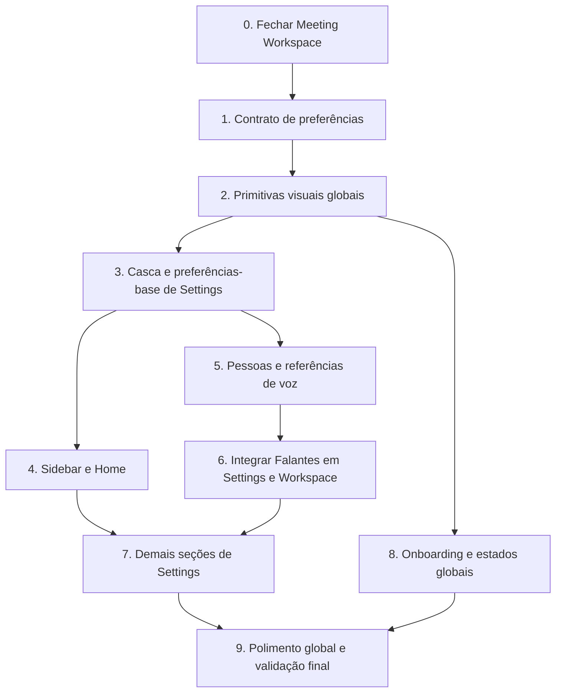

# Ordem recomendada para implementar os planos Talat

**Data da revisão:** 2026-07-23  
**Objetivo:** executar os cinco planos Talat em uma sequência que estabeleça contratos compartilhados antes das telas que os consomem, evite refatorações duplicadas e mantenha o aplicativo utilizável após cada etapa.

## Estado encontrado

| Plano | Estado na revisão | Decisão |
| --- | --- | --- |
| `2026-07-22-talat-meeting-workspace.md` | As tarefas funcionais 1--7 já têm commits no histórico (`10862f9` até `8b4ea01`). Há alterações locais não commitadas de responsividade/i18n e a validação final ainda precisa ser concluída. | Concluir e estabilizar antes de iniciar outra frente. |
| `2026-07-22-talat-settings-refactor.md` | Não há os novos componentes/contratos previstos no código indexado. | É a fundação de preferências e deve vir cedo. |
| `2026-07-22-talat-global-ui-polish-and-onboarding.md` | Não há primitivas globais previstas (`AppStatus`, `AppShell` etc.) no código indexado. | Criar a fundação visual logo após o contrato de preferências. |
| `2026-07-22-talat-sidebar-home-refactor.md` | Não há a nova camada `AppShell`/diretório nativo prevista no código indexado. | Fazer depois que a preferência de barra lateral e as primitivas visuais existirem. |
| `2026-07-22-talat-speakers-voice-references.md` | Não há o modelo normalizado de pessoas/referências de voz previsto no código indexado. | Implementar antes de migrar a área de Falantes das configurações e antes da integração final com o workspace. |

> Os arquivos de plano permanecem sem alteração de checkboxes: o status acima foi inferido do histórico Git e do código indexado, não dos próprios documentos.

## Caminho crítico recomendado

## Ordem de execução

### 0. Concluir o Meeting Workspace já iniciado

Use `2026-07-22-talat-meeting-workspace.md`, começando pela **Task 8**. Primeiro incorpore ou descarte conscientemente as alterações locais atuais de `MeetingWorkspace`, `page-content`, testes e catálogos. Em seguida execute a verificação visual, acessibilidade, responsividade do painel de participantes e os testes/compilação definidos pelo plano.

**Por que primeiro:** há uma implementação em andamento no diretório de trabalho. Trocar `SidebarProvider`, navegação, temas ou modelos de falante antes de estabilizá-la aumenta muito a superfície de regressão e dificulta identificar a causa de uma falha.

### 1. Definir o contrato único de preferências

Execute a **Tarefa 1** de `2026-07-22-talat-settings-refactor.md`.

Entregue `settings-preferences.ts`, normalização/migração, persistência segura no `ConfigContext` e todas as chaves i18n. Não implemente controles decorativos nesta etapa: cada preferência adicionada precisa ter dono e efeito planejado.

**Dependência que resolve:** tema, escala e preferência de barra lateral passam a ter uma única fonte de verdade. O plano de UI global declara explicitamente que consome `data-theme` e `--ui-scale`; a Home/Sidebar consome a preferência de colapso.

### 2. Criar tokens e primitivas visuais globais

Execute a **Task 1** de `2026-07-22-talat-global-ui-polish-and-onboarding.md`.

Entregue tokens semânticos, redução de movimento, `AppSurface`, `AppButton`, `AppDialog`, `AppStatus`, `showAppToast` e a sanitização de mensagens. Faça somente a migração global mínima de fundo/texto nesta fase.

**Dependência que resolve:** Settings, Sidebar/Home, People e o restante do polimento poderão usar os mesmos componentes e não criarão quatro dialetos visuais diferentes. O contrato de preferências da etapa 1 já fornece o tema/escala que estes tokens consomem.

### 3. Montar a estrutura de Settings e migrar as preferências-base

Execute, em ordem, as **Tarefas 2 e 3** do plano de Settings.

1. Crie `SettingsShell`, navegação por hash e `SettingsRow`/`SettingsSection`.
2. Migre Geral, Áudio e Gravações, incluindo tema, escala e preferência de barra lateral.
3. Valide retenção, dispositivos e autostart com efeitos reais no core; não prossiga se ainda houver toggles sem implementação.

**Por que antes da Sidebar/Home:** a Home nova precisa respeitar a barra lateral configurável. Isso também evita que a refatoração do provider tenha de inventar uma persistência transitória que depois será removida.

### 4. Refatorar Sidebar e Home

Execute `2026-07-22-talat-sidebar-home-refactor.md` da **Task 1 à Task 5**, sem pular as consultas locais e o hook de diretório.

1. API Rust `list_home_meetings` e testes de ordenação/limite.
2. `useMeetingDirectory` e redução de responsabilidade do `SidebarProvider`.
3. `AppShell` e componentes da sidebar.
4. Dashboard/estado ocioso da Home.
5. Acessibilidade, rotas e regressões.

**Relação com o workspace:** preserve a rota e o estado de reunião ativos já estabilizados na etapa 0. A Sidebar deve navegar até o workspace, não reimplementar seus dados nem seu player.

### 5. Normalizar pessoas e referências de voz no core

Execute as **Tasks 1, 2 e 3** de `2026-07-22-talat-speakers-voice-references.md`.

1. Migração sem perda de `speaker_profiles`, repositórios e sugestões persistidas.
2. Extração local segura, WAV de 16 kHz, embedding, limites de duração e remoção controlada de arquivos.
3. Modos `off`/`suggest`/`automatic`, bloqueio por canal e revisão explícita de sugestões.

**Por que separar o core da tela:** a Tarefa 5 do plano de Settings também mexe em matching e canais. Fazer primeiro o modelo de domínio completo evita implementar essas preferências duas vezes sobre o esquema legado.

### 6. Integrar Pessoas à UI e então migrar Falantes em Settings/Workspace

Execute as **Tasks 4 e 5** do plano de Speakers e, depois, a **Tarefa 5** do plano de Settings com o seguinte recorte:

- A tela de pessoas, referências e fila de revisão é dona do CRUD e da reprodução.
- A seção **Falantes** de Settings é uma superfície de preferências e um ponto de entrada para Pessoas; ela não deve recriar a lista/CRUD legado.
- Preserve a parte de **Transcrição** da Tarefa 5 de Settings (idioma, hotwords, pós-processamento e VAD), mas conecte matching/canais aos comandos e tipos novos do plano de Speakers.
- Faça a integração contextual do workspace (atribuir falante/salvar referência) somente depois que as sugestões e a persistência estiverem cobertas por testes.

**Resultado:** há um único modelo de dados e uma única semântica para reconhecimento, sem dois caminhos competindo para renomear segmentos.

### 7. Completar as demais seções de Settings

Execute as tarefas restantes nesta ordem:

1. **Tarefa 4:** atalhos e notificações granulares.
2. **Tarefa 6:** cadastro de LLMs e preferências de resumo.
3. **Tarefa 7:** exportação e Advanced.
4. **Tarefa 8:** migração, acessibilidade e validação integrada de Settings.

As três primeiras podem ser tratadas como fatias independentes após a estrutura de Settings estar estável, mas cada fatia deve incluir o efeito real no Rust/Tauri antes de avançar para a próxima. Não aplique a validação final da Tarefa 8 como substituta das validações específicas de cada fatia.

### 8. Centralizar feedback e aprimorar onboarding/fluxos secundários

Retome o plano global e execute as **Tasks 2 a 5**:

1. Camada global de dialogs/toasts.
2. Fluxo de onboarding.
3. Importação, recuperação e atualização.
4. Tray e presença de gravação.

**Por que agora:** esses fluxos usarão primitives já provadas e poderão apresentar os estados de preferência, gravação e modelos existentes sem criar contratos provisórios.

### 9. Polimento global e gate final do produto

Execute a **Task 6** do plano global por último. Faça a revisão visual e de acessibilidade atravessando Home, Settings, Workspace, Pessoas, onboarding, importação, recuperação, atualização e tray; depois rode todos os gates definidos em cada plano.

## Regras para evitar retrabalho

- Não implemente a semântica de matching/canal da Tarefa 5 de Settings sobre `speaker_profiles`; ela pertence ao modelo normalizado do plano de Speakers.
- Não transforme a Sidebar/Home em uma segunda fonte de dados de reuniões: use o diretório nativo e o hook do plano correspondente.
- Não migre telas individuais para cores/Tailwind próprios antes da etapa 2; use tokens e primitives globais.
- Mantenha cada etapa em commits pequenos e validados. Os cinco planos afirmam que os arquivos de plano não devem ser commitados.
- Depois de cada etapa que altera Rust/Tauri, execute o teste focado, `cargo check --manifest-path frontend/src-tauri/Cargo.toml`, e os testes/lint TypeScript afetados. Reserve o build completo e o teste manual do desktop para os gates indicados.

## Ordem curta para acompanhar

1. Fechar Workspace.
2. Preferências (contrato).
3. Primitivas globais.
4. Shell + Geral/Áudio/Gravações de Settings.
5. Sidebar/Home.
6. Core de Pessoas/referências.
7. UI de Pessoas + integração Falantes/Workspace.
8. Atalhos/Notificações, LLM/Resumos, Exportação/Advanced.
9. Onboarding/recuperação/importação/tray.
10. Polimento e validação final.
